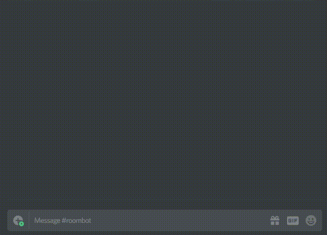

    <h1>RoomBot</h1>
    
    <h3>Create your own rooms for games and more!</h3>
    

        <a href="https://discordapp.com/api/oauth2/authorize?client_id=592816310656696341&permissions=268437520&scope=bot"> Invite RoomBot </a>
        or
        <a href="https://discord.gg/37kzrpr">join the server</a>!
    

    

--------

Sometimes you want to play something with a group, but everyone's busy at the moment. RoomBot allows you to create rooms to let everyone know that you're ready to play/do something.

## Running Your Own RoomBot
1. Clone this repository.
2. Rename `example.env` to `.env` and update its contents
    * `DISCORD_BOT_TOKEN` is bot token from [Discord Developer Portal](https://discordapp.com/developers/applications/)
3. Install `pipenv`
    * macOS (Terminal) `brew install pipenv` or `pip3 install pipenv`
    * linux (Fedora 28) `sudo dnf install pipenv`
    * windows (Powershell) `pip install pipenv`
4. `pipenv shell`
5. `pipenv install`
6. `python3 index.py`

## Features
* RoomBot will automatically disband inactive rooms.
* A colorful hoisted role is assigned to players who join the room, so you know who's in what room.
* A private channel is created for your room.
* Once you have enough people, RoomBot will notify everybody!

### Basic Commands
* `new` Create a new room based on your current activity or message
* `list` List rooms in current guild.
* `join` Join a room with `@someone` or the room name
* `leave` Leave a room
* `look` Show room information
* ... and more!

## Help improve RoomBot
RoomBot is still growing up. If there are any features you would like to see added, [create a new issue](https://github.com/Milotrince/discord-roombot/issues/new) or message me on Discord (Milotrince#0001)!

--------

    <b>Made for Discord Hack Week ♥</b>
     <a href="https://blog.discordapp.com/discord-community-hack-week-category-winners-bd0364360f92">1st place Social Bot! Thank you Discord!</a>
    <a href="https://blog.discordapp.com/discord-community-hack-week-build-and-create-alongside-us-6b2a7b7bba33"><a>

